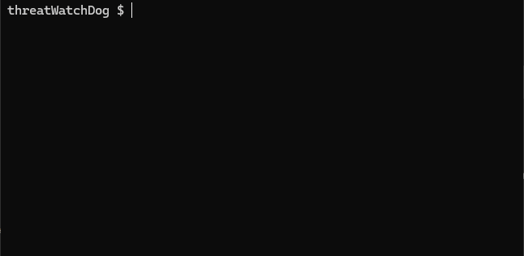

# threatWatchDog ; Monitor EPSS and notify of changes

**The current program is a proof of concept.**

We plan to revise it later to make it more production-ready.
- Responses available to other scripts. (like a api)
- Notification function when data updating.
- ...

## What does this software do?

This software provides the following information:
- Notifies of sudden increases in EPSS Scores
- Notifies of newly registered CVE-IDs in EPSS

What's good about it?
- Recognize CVE-IDs that are more likely to be attacked
- See the status of newly registered CVE-IDs

Relatively environmentally friendly.
- Written in shell script
- Does not leave data in DB

## Requirement

based on shell script.

The following packages are required for ubuntu:

- `wget`
- `sqlite3`

## How to use


1. `$ git clone https://github.com/threatWatchDog`
2. `$ cd threatWatchDog
3. `$ ./watchdog.sh`



### example.

```
|CVE-ID         |Diff    |EPSS(-1day)       |Percentile(-1day) |
|---------------|--------|------------------|------------------|
|CVE-2024-38112 |0.72506 |0.73659 (0.01153) |0.98172 (0.85092) |
```

- CVE-ID:
  - CVE-ID.
- Diff
  - The scores are displayed in order of the largest difference from the previous day's EPSS score.
- EPSS(-1day)
  - EPSS score for that day will be displayed, with the previous day's EPSS score shown in brackets.
ーPercentile(-1day)
  - Percentile for that day will be displayed, with the previous day's Percentile score shown in brackets.

Be careful, the higher the "diff", the more likely you are to be attacked.

- An exploit is published , registered in the KEV catalog (exploit confirmed), etc.

## NOTE

- Every time you run the script, it downloads the data from the FIRST site.
  - We recommend not running it multiple times in a short period of time.
- EPSS data is scheduled to be updated between 18:00 and 21:00 JST.
  - "IN JAPAN", If you want the latest version, do it after 6pm JST.

## Future

function

- KEV Catalog watch

option

- only epss
- only new-epss
- only sudden increases in EPSS Score
- only kev
- only new-kev
- checking mode
  - CVE-ID -> status return
