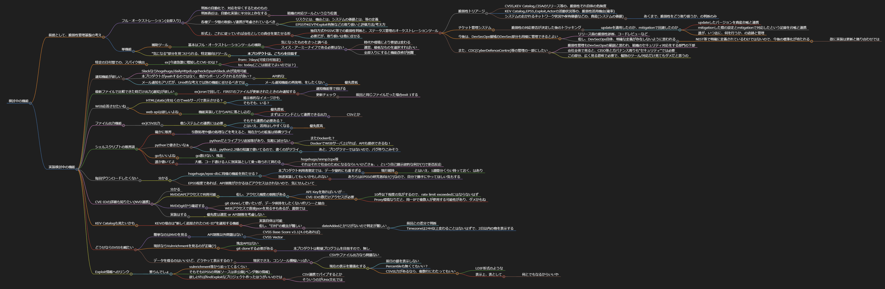

# memo

- 
  - by VSCODE: Markmap
- Japanese only

# 検討中の機能
- 前提として、脆弱性管理基盤の考え
  - フル・オーケストレーション(全部入り)
    - 判断の自動化で、対応を早くするためのもの
    - 判断責任は、自動化実装に半分以上存在する
      - 組織の対応ツールという立ち位置
    - 各種データ間の取扱い/連携が考慮されているべき
      - リスクとは、機会とは、システムの価値とは、等の定義
      - EPSSやKEVやExploit有無などの取り扱いと評価方法/考え方
    - 形式上、これに従っていれば会社としての責任を果たせる形
      - 独自方式やSSVC等での脆弱性判断と、ステータス管理のオーケストレーションツール
        - 脆弱性トリアージ
          - CVSS,KEV Catalog,CISAのリリース等の、脆弱性それ自体の危険度
          - KEV Catalog,EPSS,Exploit,Actorの活動状況等の、脆弱性活用機会(確率)
          - システムのおかれるネットワーク状況や保有価値などの、資産(システムの価値)
            - あくまで、脆弱性をどう取り扱うか、の判断のみ
        - チケット管理システム
          - 脆弱性の対応要否が決定した後のトラッキング
            - updateを適用したのか、mitigationで回避したのか
              - updateしたバージョンを資産台帳と連携
              - mitigationした際の設定とmitigationで対応したという記録を台帳と連携
              - 誰が、いつ迄に、何を行うか、の追跡と管理
        - 今後は、DevSecOps領域のDevSec部分も同様に管理できるとよい
          - リリース前の脆弱性診断、コードレビューなど
          - 但し、DevSecOps自体、明確な定義が存在しないように思われる
            - NIST等で明確に定義されているわけではないので、今後の標準化が待たれる
              - 故に実装は更新と隣り合わせでは
        - また、CDC(CyberDefenceCentre)等の管理の一部にしたい
          - 脆弱性管理もDevSecOpsの範囲と思われ、組織のセキュリティ対応をする部門の下部
          - 会社全体で見ると、CISO等とガバナンス周りも"セキュリティ"では必要
          - この部分、広く見る意味で必要で、個別のツール/対応だけ見てもダメだと思うの
      - 必要だが、取り扱いは他に任せる
  - 単機能
    - 補助ツール
      - 基本はフル・オーケストレーションツールの補助
        - 気になったものをさっと調べる
        - スイス・アーミーナイフである必要はない
          - 時代や環境により要望は変わる
          - 適宜、最低なものを選択すればいい
          - 全部入りにすると機能改修が困難
    - "気になる"部分を見つけられる、特定層向けツール
      - **本プロダクトは、こちらを目指す**
- 実装検討中の機能
  - 特定の日付間での、スパイク検出
    - ex)今週急激に増加したCVE-IDは？
      - from: 7days(可変日付指定)
      - to: today(ここは固定でよいのでは？)
  - 通知機能が欲しい
    - Slackならhogehuga/dailyHttpdLogcheckのpushSlack.shが流用可能
    - 本プロダクトがpushするのではなく、他からポーリングされる方が良い？
      - API的な
    - メール通知もアリだが、Unix的な考えでは別の機能に任せるべきでは
      - メール通知機能の再発明、をしたくない
        - 優先度低
  - 最新ファイルで比較できた時だけ出力(通知)が欲しい
    - ex)cronで回して、FIRSTのファイルが更新されたときのみ通知する
      - 通知機能等で投げる
      - 更新チェック
        - 前回と同じファイルだった場合exit 1する
  - WEB応答させたいね
    - HTML(static)を吐くのでwebサーバで表示させる？
      - 掲示板的なイメージかも
      - そもそも、いる？
    - web apiは欲しいよね
      - 機能実装してからAPIに落とし込む
        - 優先度低
        - まずはコマンドとして連携できる出力
          - CSVとか
  - ファイル出力機能
    - ex)CSV出力
      - 他システムとの連携には必要
        - そもそも連携の必要ある？
        - とはいえ、活用はしやすくなる
          - 優先度高
  - シェルスクリプトの限界説
    - 確かに限界
      - 引数処理や値の処理などを考えると、現在からの拡張は結構ツライ
    - pythonで書きたいなぁ
      - pythonだとライブラリ追加等があり、気軽に試せない
        - またDocker化？
        - DockerでWEBサーバ上げれば、APIも提供できるね！
      - 私は、python2.2頃の知識で書いてるので、書くのがツライ
        - あと、プログラマーではないので、バグ作りこみそう
    - goもいいよね
      - go書けない、残念
    - 誰か書いてよ
      - 大概、コード書ける人に別実装として乗っ取られて終わる
        - hogehuga/snmp2cpe等
        - それはそれで社会のためになるならいいけどさぁ、、という自己顕示欲的な何か(?)で拒否反応
  - 毎回ダウンロードしたくない
    - 分かる
      - hogehuga/epss-dbに同様の機能を持たせる？
        - 本プロダクト利用者想定では、データ量的にも重すぎる
          - 現行維持
            - とはいえ、1週間分くらい持っておく、はあり
        - 別途実装してもいいかもしれない
          - あちらはEPSSの研究者向け(?)なので、自分で勝手にやってほしい気もする
      - EPSS程度であれば、API制限がかかるほどアクセスはされないので、気にせんといて
  - CVE-IDの詳細も知りたい(NVD連携)
    - 分かる
    - NVDのAPIアクセスで利用可能
      - 但し、アクセス頻度の制限がある
        - API Keyを取ればいいが…
        - CVE-IDの数だけアクセスが必要
          - 10件以下程度の気がするので、rate limit exceededにはならないはず
          - Proxy環境なりだと、同一IPで複数人が使用する可能性があり、ダメかもね
    - NVDのgitから確認する
      - git cloneして使いたいが、データ保持をしたくないポリシーと競合
      - WEBアクセスで直接jsonを見る手もあるが、面倒では
    - 実装はする
      - 優先度は適宜 or API制限を考慮しない
  - KEV Catalogも見たいかも
    - KEVの場合は”新しく追加されたCVE-ID”を通知する機能
      - 実装自体は可能
      - 但し、"日付"の概念が難しい
        - dateAddedとかTZがないので判定が難しい
          - 前回との差分で判断
          - Timezoneは24H以上変わることはないはずで、2日以内の物を表示する
  - どうせならSVSSも観たい
    - 簡単なのはNVDを見る
      - API制限以外問題はない
        - CVSS Base Score v3.1(4.0もあれば)
        - CVSS Vector
    - 現状ならVulnrichmentを見るのが正確(?)
      - 残念APIはない
      - git cloneする必要がある
        - 本プロダクトは軽量プログラムを目指すので、無し
    - データを得るのはいいけど、どうやって表示するの？
      - 現状でさえ、コンソール横幅いっぱい
        - CSVやファイル出力なら問題ない
        - 現在の表示を簡素化する
          - 前日の値を表示しない
          - Percentileも無くてもいい？
          - CSV出力があるなら、複数行にわたってもいい
            - LDIF形式のような
            - 表示上、表として
              - 何とでもなるからいいや
  - Exploit情報へのリンク
    - 要らんでしょ
      - vulnrichment等から拾ってくるくらい
      - そもそもEPSSの判断ソースは非公開(ベンダ側の情報)
      - 欲しければfindExploitなプロジェクト作ったほうがいいのでは
        - CSV連携でパイプするとか
        - そういうのがUnix文化では
